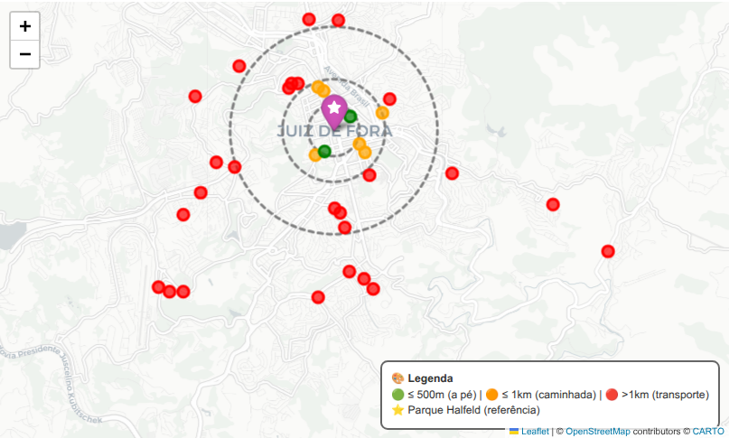
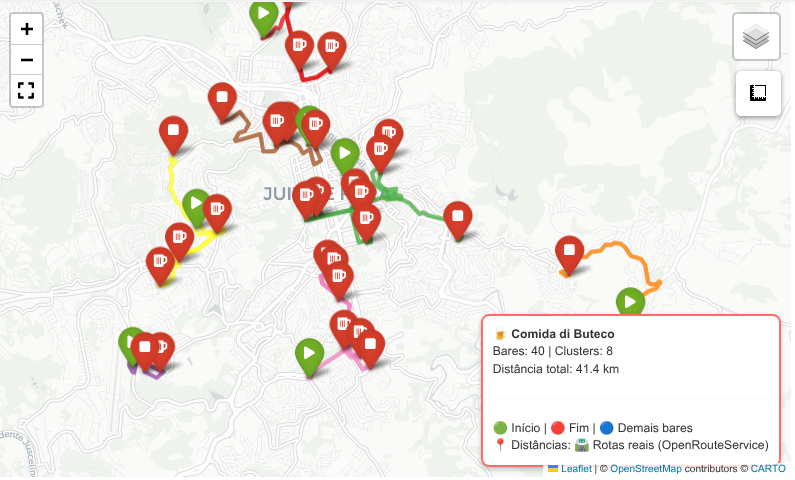

# Roteirizador com *OpenRouteService*

### Introdução

A segunda abordagem integra a **API** do *OpenRouteService* (**ORS**), que introduziu o conceito de rotas reais baseadas na infraestrutura viária do *OpenStreetMap*. Esta solução passou a considerar corretamente a orientação das ruas, restrições de tráfego e diferentes modos de transporte (pedestre, carro, bicicleta), retornando distâncias e durações muito mais realistas. 

A principal vantagem do **ORS** é a qualidade dos dados e a riqueza dos metadados fornecidos, incluindo geometria detalhada das rotas, altitudes e instruções passo a passo. Além disso, a **API** oferece suporte a múltiplos perfis de roteamento, como *foot-walking* para pedestres e *driving-car* para automóveis, permitindo adaptar o planejamento ao meio de locomoção dos participantes do evento. 

No entanto, a abordagem apresentou desafios práticos significativos: a necessidade de cadastro e obtenção de chave de **API**, limites diários de requisições e uma política de segurança que exige cabeçalhos HTTP específicos como *Referer*, que causou erros 403 durante os testes. 

O processo de autenticação e configuração revelou-se um ponto de atrito, exigindo ajustes manuais no ambiente de desenvolvimento. Outra desvantagem foi a latência das requisições, já que cada par de pontos demandava uma chamada **HTTP**, tornando o cálculo de matrizes de distância para muitos pontos um processo relativamente lento, embora ainda aceitável para dezenas de localizações.

Leia [aqui](https://github.com/guiajf/roteirizador-osmnx) o primeiro artigo da série.

### Bibliotecas

Carregamos as seguintes bibliotecas:

- **pandas**: biblioteca fundamental para análise de dados em Python, oferece estruturas como DataFrame e Series para manipulação e análise de dados tabulares. Neste projeto, é utilizada para carregar e inspecionar a lista dos 40 bares participantes.

- **numpy**: pacote essencial para computação científica, fornece suporte a arrays multidimensionais e funções matemáticas de alto desempenho. Utilizado para operações de conversão de coordenadas e cálculos auxiliares.

- **folium**: biblioteca para visualização geoespacial interativa, baseada em *Leaflet.js*. Plugins *Fullscreen* e *MeasureControl* adicionam tela cheia e ferramenta de medição ao mapa. Utilizada para criar o mapa final com rotas e clusters.

- **sklearn.cluster.KMeans**: módulo para clustering baseado em centroides. Implementa o algoritmo *K-Means* para agrupamento de pontos por proximidade geográfica. Utilizado para dividir os 40 bares em clusters espacialmente coerentes.

- **sklearn.neighbors**: módulo especializado em busca por vizinhos
próximos. Implementa algoritmo *ball_tree* para consultas eficientes.
Utilizado para:
    a) agrupar bares em clusters por proximidade geográfica
    b) implementar a heurística gulosa do *vizinho mais próximo*,
       resolvendo o **TSP** aberto dentro de cada cluster.

- **math**: módulo da biblioteca padrão que fornece funções matemáticas fundamentais. Utilizado para implementar a função *Haversine* com as funções `radians`, `sin`, `cos`, `sqrt`, `atan2`.

- **requests**: biblioteca para requisições HTTP em Python. Utilizada para realizar chamadas à API pública do OSRM (Open Source Routing Machine) e obter rotas entre os bares.

- **json**: módulo da biblioteca padrão para manipulação de dados no formato JSON. Utilizado para processar as respostas da **API** do **ORS**.

- **time**: módulo da biblioteca padrão para controle de temporização. Utilizado para implementar *rate limiting* entre requisições à API, respeitando intervalos de 0.5 segundos para não sobrecarregar o servidor público do OSRM.

- **pickle**: módulo da biblioteca padrão para serialização de objetos Python. Utilizado para implementar sistema de *cache* das rotas obtidas, evitando requisições repetidas e acelerando execuções futuras.

- **os**: módulo da biblioteca padrão para interface com o sistema operacional. Utilizado para verificar existência de arquivos de cache e manipular caminhos.

- **warnings**: módulo da biblioteca padrão para controle de mensagens de aviso. Utilizado para suprimir alertas técnicos e manter a saída limpa e focada nos resultados.


```python
import pandas as pd
import numpy as np
import folium
from folium.plugins import MeasureControl, Fullscreen, MarkerCluster
from sklearn.cluster import KMeans
from sklearn.neighbors import NearestNeighbors
from math import radians, sin, cos, sqrt, atan2
import requests
import json
import time
import pickle
import os
import warnings
warnings.filterwarnings('ignore')
```

### Cadastamos a chave API

Para cadastrar e obter sua chave de **API** gratuita no *Openrouteservice* (**ORS**), acesse o [Openrouteservice Dashboard](https://api.openrouteservice.org/), faça *login* ou crie uma conta. Vá até a aba *Tokens*, clique em *Create Token*, escolha um nome para a sua chave e copie o código gerado em lugar seguro.

### Exportamos a chave


```python
%env ORS_MODE=driving-car
%env ORS_API_KEY=***********************************************************************************
```

    env: ORS_MODE=driving-car
    env: ORS_API_KEY=***********************************************************************************


### Realizamos o diagnóstico da conexão


```python
print(f"\n1. Chave no os.environ: {'✅ Presente' if 'ORS_API_KEY' in os.environ else '❌ Ausente'}")
print(f"   os.getenv('ORS_API_KEY'): {'✅ Presente' if os.getenv('ORS_API_KEY') else '❌ Ausente'}")

api_key = os.getenv('ORS_API_KEY')
if api_key:
    print(f"\n2. Testando requisição direta à API...")
    
    url = "https://api.openrouteservice.org/v2/directions/driving-car"
    headers = {
        "Authorization": api_key,
        "Content-Type": "application/json",
        "User-Agent": "RoteirizadorComidaButeco/1.0"
    }
    payload = {
        "coordinates": [[-43.3499, -21.7616], [-43.3468, -21.7608]],
        "geometry": True,
        "instructions": False
    }
    
    response = requests.post(url, json=payload, headers=headers, timeout=30)
    print(f"   Status Code: {response.status_code}")
    
    if response.status_code == 200:
        data = response.json()
        # ✅ Verificar 'routes' em vez de 'features'
        if 'routes' in data and len(data['routes']) > 0:
            route = data['routes'][0]
            if 'geometry' in route and isinstance(route['geometry'], str):
                print(f"   ✅ API funcionando! Geometria polyline com {len(route['geometry'])} caracteres")
                print(f"   📏 Distância da rota: {route.get('summary', {}).get('distance', 0)/1000:.2f} km")
            else:
                print(f"   ⚠️ Geometria não é string polyline")
        else:
            print(f"   ⚠️ Resposta 200 mas sem rotas válidas")
            print(f"   Keys disponíveis: {list(data.keys())}")
    elif response.status_code == 403:
        print(f"   ❌ Erro 403: API Key inválida ou bloqueada")
    elif response.status_code == 400:
        print(f"   ❌ Erro 400: Parâmetro inválido")
        print(f"   Resposta: {response.text[:200]}")
    else:
        print(f"   ❌ Erro {response.status_code}: {response.text[:200]}")
else:
    print("\n❌ API Key não encontrada no ambiente!")
```

    
    1. Chave no os.environ: ✅ Presente
       os.getenv('ORS_API_KEY'): ✅ Presente
    
    2. Testando requisição direta à API...
       Status Code: 200
       ✅ API funcionando! Geometria polyline com 73 caracteres
       📏 Distância da rota: 1.40 km


## Exploramos a API

**Realizamos um teste rápido de rota**

Aprendemos como a **API** responde, onde estão os metadados úteis e como formatar coordenadas corretamente ([lon, lat]).


```python
url = "https://api.openrouteservice.org/v2/directions/driving-car"
headers = {"Authorization": api_key, "Content-Type": "application/json"}

# Coordenadas: [longitude, latitude]
payload = {
    "coordinates": [[-43.3499, -21.7616], [-43.3468, -21.7608]],
    "geometry": True,
    "instructions": False
}

resp = requests.post(url, json=payload, headers=headers)
data = resp.json()

print(f"✅ Status: {resp.status_code}")
print(f"📏 Distância real: {data['routes'][0]['summary']['distance']/1000:.2f} km")
print(f"⏱️ Tempo estimado: {data['routes'][0]['summary']['duration']/60:.1f} min")
```

    ✅ Status: 200
    📏 Distância real: 1.40 km
    ⏱️ Tempo estimado: 2.7 min


**Decodificamos uma Polyline**

*Polyline* é um formato de geometria codificada utilizado pela *OpenRouteService* para representar rotas e trajetórias de forma compacta. A **ORS** retorna a rota como uma string compacta, transformada em uma lista de latitude e longitude pela função personalizada *decode_polyline()*, com a qual aprendemos como dados geoespaciais são compactados para trafegar rápido na internet. Cada ponto é uma *marcação* na rua. Para ambientes de produção, a biblioteca oficial **openrouteservice** oferece a decodificação validada e otimizada.


```python
def decode_polyline(encoded):
    idx, lat, lng = 0, 0, 0
    coords = []
    while idx < len(encoded):
        shift, res = 0, 0
        while True:
            b = ord(encoded[idx]) - 63; idx += 1
            res |= (b & 0x1F) << shift; shift += 5
            if b < 0x20: break
        lat += ~(res >> 1) if res & 1 else (res >> 1)
        
        shift, res = 0, 0
        while True:
            b = ord(encoded[idx]) - 63; idx += 1
            res |= (b & 0x1F) << shift; shift += 5
            if b < 0x20: break
        lng += ~(res >> 1) if res & 1 else (res >> 1)
        coords.append([lat/1e5, lng/1e5])
    return coords

poly = data['routes'][0]['geometry']
pontos = decode_polyline(poly)
print(f"🔍 Rota decodificada: {len(pontos)} pontos")
print(f"📍 Primeiro: {pontos[0]}")
print(f"📍 Último: {pontos[-1]}")
```

    🔍 Rota decodificada: 19 pontos
    📍 Primeiro: [-21.76155, -43.34969]
    📍 Último: [-21.76082, -43.34689]


**Comparamos *Haversine* com ORS**

A distância em linha reta é calculada pela fórmula de *Haversine*, que considera a curvatura terrestre. Para rotas viárias, a *OpenRouteService* modela ruas como grafos ponderados, resolvendo caminhos mínimos com variações de *Dijkstra*.


```python
def haversine(lat1, lon1, lat2, lon2):
    R = 6371000
    dlat, dlon = map(radians, [lat2-lat1, lon2-lon1])
    a = sin(dlat/2)**2 + cos(radians(lat1))*cos(radians(lat2))*sin(dlon/2)**2
    return R * 2 * atan2(sqrt(a), sqrt(1-a))

dist_reta = haversine(-21.7616, -43.3499, -21.7608, -43.3468)
dist_ors = data['routes'][0]['summary']['distance']

print(f"📏 Linha reta: {dist_reta/1000:.3f} km")
print(f"🛣️ Via ORS:   {dist_ors/1000:.3f} km")
print(f"📈 Diferença: {(dist_ors-dist_reta)/1000:.3f} km ({((dist_ors-dist_reta)/dist_reta)*100:.1f}%)")
```

    📏 Linha reta: 0.332 km
    🛣️ Via ORS:   1.401 km
    📈 Diferença: 1.069 km (321.6%)


**Simulamos diferentes  meios de transporte**

Aprendemos que a **ORS** suporta perfis diferentes: pedestres usam atalhos, ciclistas eviam ladeiras, carros seguem vias arteriais.


```python
modos = ["driving-car", "foot-walking", "cycling-regular"]
for modo in modos:
    url_modo = f"https://api.openrouteservice.org/v2/directions/{modo}"
    payload_modo = {
        "coordinates": [[-43.3499, -21.7616], [-43.3468, -21.7608]],
        "geometry": False, "instructions": False
    }
    resp = requests.post(url_modo, json=payload_modo, headers=headers)
    if resp.status_code == 200:
        dist = resp.json()['routes'][0]['summary']['distance']
        dur = resp.json()['routes'][0]['summary']['duration']
        print(f"🚶 {modo}: {dist/1000:.2f} km | ⏱️ {dur/60:.1f} min")
```

    🚶 driving-car: 1.40 km | ⏱️ 2.7 min
    🚶 foot-walking: 0.81 km | ⏱️ 9.8 min
    🚶 cycling-regular: 0.88 km | ⏱️ 3.0 min


### Estatísticas espaciais do dataset

**Carregamos e inspecionamos os dados**

**Carregamos o dataset**


```python
gdf = pd.read_csv("lista_bares.csv")
X = np.array(gdf[['latitude', 'longitude']])
```

**Inspecionamos os dados**


```python
print("=== Informações do dataset ===\n")
gdf.info()

print("\n=== Primeiras 5 coordenadas (lat, lon) ===\n")
print(X[:5])

print(f"\nTotal de bares carregados: {len(gdf)}")
print(f"Colunas disponíveis: {list(gdf.columns)}")
```

    === Informações do dataset ===
    
    <class 'pandas.DataFrame'>
    RangeIndex: 40 entries, 0 to 39
    Data columns (total 9 columns):
     #   Column         Non-Null Count  Dtype  
    ---  ------         --------------  -----  
     0   Name           40 non-null     str    
     1   longitude      40 non-null     float64
     2   latitude       40 non-null     float64
     3   Endereço       40 non-null     str    
     4   Petisco        40 non-null     str    
     5   Contato        40 non-null     str    
     6   Instagram      40 non-null     str    
     7   Descrição      40 non-null     str    
     8   Funcionamento  40 non-null     str    
    dtypes: float64(2), str(7)
    memory usage: 2.9 KB
    
    === Primeiras 5 coordenadas (lat, lon) ===
    
    [[-21.7819995 -43.2989666]
     [-21.7365987 -43.3609957]
     [-21.7586111 -43.3472222]
     [-21.766567  -43.3723106]
     [-21.7756168 -43.378489 ]]
    
    Total de bares carregados: 40
    Colunas disponíveis: ['Name', 'longitude', 'latitude', 'Endereço', 'Petisco', 'Contato', 'Instagram', 'Descrição', 'Funcionamento']


**Calculamos estatísticas básicas sem ponto de referência**


```python
df_bares = gdf.copy()

# 📍 Centroide (média das coordenadas)
centroide_lat = df_bares['latitude'].mean()
centroide_lon = df_bares['longitude'].mean()
print(f"🎯 Centroide dos bares: ({centroide_lat:.6f}, {centroide_lon:.6f})")

# 📏 Dispersão (desvio padrão espacial)
std_lat = df_bares['latitude'].std()
std_lon = df_bares['longitude'].std()
print(f"📐 Dispersão: ±{std_lat*111000:.0f}m lat / ±{std_lon*111000:.0f}m lon")
# Nota: 1° de latitude ≈ 111 km

# 🗺️ Área aproximada do envelope (bounding box)
min_lat, max_lat = df_bares['latitude'].min(), df_bares['latitude'].max()
min_lon, max_lon = df_bares['longitude'].min(), df_bares['longitude'].max()
area_km2 = (max_lat - min_lat) * 111 * (max_lon - min_lon) * 111 * cos(radians(centroide_lat))
print(f"📦 Área do envelope: {area_km2:.2f} km²")

# 🔄 Distâncias entre todos os pares (matriz)
distancias = []
for i in range(len(df_bares)):
    for j in range(i+1, len(df_bares)):
        d = haversine(
            df_bares.iloc[i]['latitude'], df_bares.iloc[i]['longitude'],
            df_bares.iloc[j]['latitude'], df_bares.iloc[j]['longitude']
        )
        distancias.append(d)

print(f"\n📈 Distâncias entre bares:")
print(f"   Média: {np.mean(distancias)/1000:.2f} km")
print(f"   Mediana: {np.median(distancias)/1000:.2f} km")
print(f"   Mín: {min(distancias)/1000:.2f} km | Máx: {max(distancias)/1000:.2f} km")
```

    🎯 Centroide dos bares: (-21.758952, -43.359572)
    📐 Dispersão: ±2925m lat / ±3059m lon
    📦 Área do envelope: 164.28 km²
    
    📈 Distâncias entre bares:
       Média: 4.54 km
       Mediana: 3.55 km
       Mín: 0.10 km | Máx: 17.79 km


O *centroide*  é o *ponto de equilíbrio* do conjunto, ideal para definir um local de encontro central. O *desvio padrão* superior a 2km indica que os bares estão espalhados. A *area do envelope*, que representa o espaço mínimo que contém todos os bares,  é útil para estimar tempo de deslocamento máximo. A *distância mediana* revela que metade dos pares de bares está a menos de 3,5 km.


**Calculamos estatísticas básicas com ponto de referência**

Adotamos o *Parque Halfeld* como ponto zero para análises contextuais:


```python
# Coordenadas do Parque Halfeld
REF_LAT, REF_LON = -21.760969458716477, -43.35033556236779

# 🚶 Distância de cada bar até o parque
df_bares['dist_halfeld_m'] = df_bares.apply(
    lambda row: haversine(REF_LAT, REF_LON, row['latitude'], row['longitude']), 
    axis=1
)

print(f"🚶 Distâncias dos bares até o Halfeld:")
print(f"   Mais próximo: {df_bares['dist_halfeld_m'].min()/1000:.2f} km")
print(f"   Mais distante: {df_bares['dist_halfeld_m'].max()/1000:.2f} km")
print(f"   Média: {df_bares['dist_halfeld_m'].mean()/1000:.2f} km")
print(f"   Mediana: {df_bares['dist_halfeld_m'].median()/1000:.2f} km")

# 🥇 Ranking: bares mais próximos do parque
print(f"\n🏆 Top 5 bares mais próximos do Halfeld:")
top5 = df_bares.nsmallest(5, 'dist_halfeld_m')[['Name', 'dist_halfeld_m']]
for idx, row in top5.iterrows():
    print(f"   {idx+1}. {row['Name']}: {row['dist_halfeld_m']/1000:.2f} km")

# 🚶‍♂️ Acessibilidade a pé (raio de 1 km)
acessiveis_a_pe = df_bares[df_bares['dist_halfeld_m'] <= 1000]
print(f"\n🚶‍♂️ Bares acessíveis a pé do Halfeld (≤ 1 km): {len(acessiveis_a_pe)} de {len(df_bares)}")
print(f"   Percentual: {len(acessiveis_a_pe)/len(df_bares)*100:.1f}%")

# 🧭 Direção predominante (azimute)
def calcular_azimute(lat1, lon1, lat2, lon2):
    """Azimute em graus: 0°=Norte, 90°=Leste, 180°=Sul, 270°=Oeste"""
    lat1, lon1, lat2, lon2 = map(radians, [lat1, lon1, lat2, lon2])
    dlon = lon2 - lon1
    y = sin(dlon) * cos(lat2)
    x = cos(lat1)*sin(lat2) - sin(lat1)*cos(lat2)*cos(dlon)
    azimute = atan2(y, x)
    return (np.degrees(azimute) + 360) % 360

df_bares['azimute_halfeld'] = df_bares.apply(
    lambda row: calcular_azimute(REF_LAT, REF_LON, row['latitude'], row['longitude']), 
    axis=1
)

# Histograma de direções
bins = [0, 45, 90, 135, 180, 225, 270, 315, 360]
labels = ['N', 'NE', 'L', 'SE', 'S', 'SO', 'O', 'NO']
df_bares['direcao'] = pd.cut(df_bares['azimute_halfeld'], bins=bins, labels=labels, include_lowest=True)

print(f"\n🧭 Direção dos bares em relação ao Halfeld:")
for direcao in labels:
    n = len(df_bares[df_bares['direcao'] == direcao])
    if n > 0:
        print(f"   {direcao}: {n} bares ({n/len(df_bares)*100:.1f}%)")
```

    🚶 Distâncias dos bares até o Halfeld:
       Mais próximo: 0.41 km
       Mais distante: 12.22 km
       Média: 3.01 km
       Mediana: 2.28 km
    
    🏆 Top 5 bares mais próximos do Halfeld:
       3. BAR DO ABILIO: 0.41 km
       21. CARLOTA: 0.44 km
       20. CAMINHO DA ROCA: 0.57 km
       13. BAR DU CHICO: 0.58 km
       34. PAPPADOG BAR: 0.73 km
    
    🚶‍♂️ Bares acessíveis a pé do Halfeld (≤ 1 km): 8 de 40
       Percentual: 20.0%
    
    🧭 Direção dos bares em relação ao Halfeld:
       N: 1 bares (2.5%)
       NE: 3 bares (7.5%)
       L: 5 bares (12.5%)
       SE: 7 bares (17.5%)
       S: 4 bares (10.0%)
       SO: 6 bares (15.0%)
       O: 6 bares (15.0%)
       NO: 8 bares (20.0%)


As estatísticas com ponto de referência ajudam a identificar quais bares estão a menos de 10 minutos a pé do ponto de encontro, a classificar bares por distância do parque, de acordo com o meio de transporte: a pé, táxi ou carro. O *Azimute* revela se há concentração em uma determinada direção, por exemplo, mais bares a leste. A distância mediana ajuda a definir clusters com deslocamento viável.

**Geramos um relatório com as estatísticas básicas**


```python
# Gerar tabela para exportar (CSV/Markdown)
resumo = {
    'Métrica': [
        'Total de bares',
        'Centroide (lat, lon)',
        'Área do envelope (km²)',
        'Distância média entre bares (km)',
        'Distância mediana até o Halfeld (km)',
        'Bares a ≤1km do Halfeld',
        'Direção predominante',
        'Bar mais próximo do Halfeld',
        'Bar mais distante do Halfeld'
    ],
    'Valor': [
        len(df_bares),
        f"({centroide_lat:.5f}, {centroide_lon:.5f})",
        f"{area_km2:.2f}",
        f"{np.mean(distancias)/1000:.2f}",
        f"{df_bares['dist_halfeld_m'].median()/1000:.2f}",
        f"{len(acessiveis_a_pe)} ({len(acessiveis_a_pe)/len(df_bares)*100:.1f}%)",
        df_bares['direcao'].mode()[0],
        f"{df_bares.nsmallest(1, 'dist_halfeld_m').iloc[0]['Name']} ({df_bares['dist_halfeld_m'].min()/1000:.2f} km)",
        f"{df_bares.nlargest(1, 'dist_halfeld_m').iloc[0]['Name']} ({df_bares['dist_halfeld_m'].max()/1000:.2f} km)"
    ]
}

df_resumo = pd.DataFrame(resumo)
print("\n📋 RESUMO PARA RELATÓRIO")
print(df_resumo.to_markdown(index=False))
```

    
    📋 RESUMO PARA RELATÓRIO
    | Métrica                              | Valor                   |
    |:-------------------------------------|:------------------------|
    | Total de bares                       | 40                      |
    | Centroide (lat, lon)                 | (-21.75895, -43.35957)  |
    | Área do envelope (km²)               | 164.28                  |
    | Distância média entre bares (km)     | 4.54                    |
    | Distância mediana até o Halfeld (km) | 2.28                    |
    | Bares a ≤1km do Halfeld              | 8 (20.0%)               |
    | Direção predominante                 | NO                      |
    | Bar mais próximo do Halfeld          | BAR DO ABILIO (0.41 km) |
    | Bar mais distante do Halfeld         | BAR DO BREJO (12.22 km) |


Justificamos a escolha de cada métrica: utilizamos *Haversine* para distâncias, porque possui precisão suficiente para escala urbana, em um raio inferior a 20 km e por ser mais simples que projeções complexas. A *mediana* é resistente a valores atípicos. O *Azimute* é útil para o planejamento dos deslocamentos, pois é mais intuitivo que graus exatos. Escolhemos o raio de 1 km para deslocamento *a pé*, correspondente a ~12 minutos de caminhada, limite comum em estudos de mobilidade urbana. Selecionamos o *centroide* como referência interna, pois minimiza a soma das distâncias quadradas, sendo *ponto de menor esforço* para o grupo.

### Criamos um mapa com círculos concêntricos

Considerando o *Parque Halfeld* como o ponto de encontro oficial dos interessados no concurso *Comida di Buteco*, usamos a coluna *dist_halfeld_m* para ordenar os bares no roteiro final — começando pelos mais próximos e expandindo em anéis concêntricos. Isso reduz o tempo de deslocamento inicial e melhora a experiência do grupo.


```python
# Mapa centrado no Halfeld
m = folium.Map(location=[REF_LAT, REF_LON], zoom_start=14, tiles='CartoDB Positron')

# Marcador do Parque Halfeld
folium.Marker(
    [REF_LAT, REF_LON],
    popup="<b>🌳 Parque Halfeld</b><br>Ponto de referência",
    icon=folium.Icon(color='purple', icon='star', prefix='fa'),
    tooltip="Parque Halfeld"
).add_to(m)

# Círculos de raio (500m, 1km, 2km)
for raio_m in [500, 1000, 2000]:
    folium.Circle(
        location=[REF_LAT, REF_LON],
        radius=raio_m,
        color='gray',
        fill=False,
        dash_array='5,5',
        popup=f"Raio de {raio_m/1000:.0f} km"
    ).add_to(m)

# Bares coloridos por distância do Halfeld
for _, bar in df_bares.iterrows():
    cor = 'green' if bar['dist_halfeld_m'] <= 500 else 'orange' if bar['dist_halfeld_m'] <= 1000 else 'red'
    folium.CircleMarker(
        [bar['latitude'], bar['longitude']],
        radius=6,
        color=cor,
        fill=True,
        fill_opacity=0.7,
        popup=f"<b>{bar['Name']}</b><br>🚶 {bar['dist_halfeld_m']/1000:.2f} km do Parque Halfeld",
        tooltip=bar['Name']
    ).add_to(m)

# Legenda
legenda = '''
<div style="position: fixed; bottom: 10px; right: 10px; z-index: 1000;
            background: white; padding: 10px; border-radius: 8px;
            border: 2px solid #666; font-size: 12px;">
    <b>🎨 Legenda</b><br>
    🟢 ≤ 500m (a pé) | 🟠 ≤ 1km (caminhada) | 🔴 >1km (transporte)<br>
    ⭐ Parque Halfeld (referência)
</div>
'''
m.get_root().html.add_child(folium.Element(legenda))

# Visualizamos o mapa
m
```




### Tudo junto fica assim

**Código completo para gerar o mapa com rotas**

Depois de carregar os pontos, agrupamos bares próximos geograficamente através do algoritmo de aprendizado não supervisionado **K-means**, que calcula o número ideal de *clusters* baseado na densidade espacial, evitando que uma rota cruze a cidade inteira. A classe `OpenRouteServiceClient`salva as rotas já calculadas em formato *.pkl* para não repetir chamadas.

Dentro de cada *cluster*, o código decide em que ordem visitar os bares. O *Problema do Caixeiro Viajante* é matematicamente complexo, pois para dezenas de pontos, usar a solução exata levaria horas. O *algoritmo guloso* escolhe sempre o bar mais próximo do atual. É rápido, previsível e, para distâncias curtas, entrega rotas muito eficientes.

Finalmente, geramos um mapa interativo com **folium**, que em vez de ligar bares com linhas retas, desenha cada segmento da rota decodificada, seguindo exatamente o traçado das vias, com marcadores coloridos que indicam início, fim e paradas intermediárias.


```python
# ============================================
# CONFIGURAÇÕES
# ============================================

from dotenv import load_dotenv
import os as os_env

load_dotenv()

ORS_API_KEY = os_env.getenv('ORS_API_KEY')
ORS_MODE = os_env.getenv('ORS_MODE', 'driving-car')
MAX_DISTANCE_KM = float(os_env.getenv('ORS_MAX_DISTANCE_KM', 20))

if not ORS_API_KEY:
    raise ValueError("Configure ORS_API_KEY no arquivo .env")

print(f"\n⚙️ Configurações:")
print(f"   Modo: {ORS_MODE}")
print(f"   Distância máxima: {MAX_DISTANCE_KM} km")

# ============================================
# FUNÇÃO HAVERSINE
# ============================================

def haversine_distance(lat1, lon1, lat2, lon2):
    """Distância de Haversine em metros"""
    R = 6371000
    lat1, lon1, lat2, lon2 = map(radians, [lat1, lon1, lat2, lon2])
    dlat = lat2 - lat1
    dlon = lon2 - lon1
    a = sin(dlat/2)**2 + cos(lat1) * cos(lat2) * sin(dlon/2)**2
    c = 2 * atan2(sqrt(a), sqrt(1-a))
    return R * c

# ============================================
# FUNÇÃO DECODIFICAR POLYLINE
# ============================================

def decode_polyline(polyline_str):
    """Decodifica string polyline do ORS para lista de [lat, lon]"""
    index, lat, lng = 0, 0, 0
    coordinates = []
    
    while index < len(polyline_str):
        shift, result = 0, 0
        while True:
            b = ord(polyline_str[index]) - 63
            index += 1
            result |= (b & 0x1F) << shift
            shift += 5
            if b < 0x20:
                break
        dlat = ~(result >> 1) if (result & 1) else (result >> 1)
        lat += dlat
        
        shift, result = 0, 0
        while True:
            b = ord(polyline_str[index]) - 63
            index += 1
            result |= (b & 0x1F) << shift
            shift += 5
            if b < 0x20:
                break
        dlng = ~(result >> 1) if (result & 1) else (result >> 1)
        lng += dlng
        
        coordinates.append([lat / 1e5, lng / 1e5])
    
    return coordinates


# ============================================
# CLIENTE OPENROUTESERVICE
# ============================================

class OpenRouteServiceClient:
    def __init__(self, api_key, mode='driving-car'):
        self.api_key = api_key
        self.mode = mode
        self.base_url = "https://api.openrouteservice.org/v2"
        self.cache_file = f"ors_cache_{mode.replace('-', '_')}.pkl"
        self.last_request_time = 0
        self.request_interval = 1.0
        self.cache = self._load_cache()
    
    def _load_cache(self):
        if os.path.exists(self.cache_file):
            with open(self.cache_file, 'rb') as f:
                print(f"   📂 Cache carregado: {self.cache_file}")
                return pickle.load(f)
        return {}
    
    def _save_cache(self):
        with open(self.cache_file, 'wb') as f:
            pickle.dump(self.cache, f)
            print(f"   💾 Cache salvo: {self.cache_file}")
    
    def _wait_if_needed(self):
        elapsed = time.time() - self.last_request_time
        if elapsed < self.request_interval:
            time.sleep(self.request_interval - elapsed)
        self.last_request_time = time.time()
    
    def get_route_geometry(self, lat1, lon1, lat2, lon2, retry=3):
        """Obtém a geometria COMPLETA da rota entre dois pontos"""
        cache_key = f"route_{self.mode}_{lat1:.6f}_{lon1:.6f}_{lat2:.6f}_{lon2:.6f}"
        
        if cache_key in self.cache:
            return self.cache[cache_key]
        
        url = f"{self.base_url}/directions/{self.mode}"
        
        headers = {
            "Authorization": self.api_key,
            "Content-Type": "application/json",
            "User-Agent": "RoteirizadorComidaButeco/1.0"
        }
        
        payload = {
            "coordinates": [[lon1, lat1], [lon2, lat2]],
            "geometry": True,
            "instructions": False,
            "units": "m",
            "preference": "recommended"
        }
        
        for tentativa in range(retry):
            try:
                self._wait_if_needed()
                
                response = requests.post(url, json=payload, headers=headers, timeout=30)
                
                if response.status_code == 200:
                    data = response.json()
                    
                    if 'routes' in data and len(data['routes']) > 0:
                        route = data['routes'][0]
                        
                        if 'geometry' in route and isinstance(route['geometry'], str):
                            # ✅ CHAMADA CORRETA: função global decode_polyline
                            route_coords = decode_polyline(route['geometry'])
                            
                            distance = 0
                            for i in range(len(route_coords)-1):
                                distance += haversine_distance(
                                    route_coords[i][0], route_coords[i][1],
                                    route_coords[i+1][0], route_coords[i+1][1]
                                )
                            
                            self.cache[cache_key] = route_coords
                            self._save_cache()
                            
                            return route_coords
                        else:
                            print(f"      ⚠️ Geometria não encontrada ou formato inesperado")
                            return None
                    else:
                        print(f"      ⚠️ Resposta sem rotas: {list(data.keys())}")
                        return None
                        
                elif response.status_code == 403:
                    print(f"      ⚠️ Erro 403: Access blocked")
                    return None
                elif response.status_code == 429:
                    print(f"      ⚠️ Rate limit (429), aguardando 2s... (tentativa {tentativa+1}/{retry})")
                    time.sleep(2)
                    continue
                else:
                    print(f"      ⚠️ Erro {response.status_code}: {response.text[:150]}")
                    if tentativa < retry - 1:
                        time.sleep(1)
                        continue
                    return None
                    
            except Exception as e:
                print(f"      ⚠️ Erro de exceção: {e}")
                if tentativa < retry - 1:
                    time.sleep(1)
                    continue
                return None
        
        return None
    
    def get_distance(self, lat1, lon1, lat2, lon2):
        """Obtém distância entre dois pontos"""
        route = self.get_route_geometry(lat1, lon1, lat2, lon2)
        if route:
            dist = 0
            for i in range(len(route)-1):
                dist += haversine_distance(route[i][0], route[i][1], route[i+1][0], route[i+1][1])
            return dist
        else:
            return haversine_distance(lat1, lon1, lat2, lon2)
            
# ============================================
# CARREGAR DADOS
# ============================================

print("\n📂 Carregando dados dos bares...")

df_bares = gdf.copy()
#df_bares['Name'] = df_bares['Name'].astype(str)
df_bares = df_bares.reset_index(drop=True)

print(f"✅ {len(df_bares)} bares carregados")

# ============================================
# TESTE DA API ANTES DE COMEÇAR
# ============================================

def testar_api():
    """Testa se a API está funcionando"""
    print("\n🔍 Testando conexão com OpenRouteService...")
    
    test_client = OpenRouteServiceClient(ORS_API_KEY, mode=ORS_MODE)
    
    # Coordenadas de teste (centro de Juiz de Fora)
    lat1, lon1 = -21.7616, -43.3499
    lat2, lon2 = -21.7608, -43.3468
    
    rota = test_client.get_route_geometry(lat1, lon1, lat2, lon2)
    
    if rota:
        print(f"   ✅ API funcionando! Rota obtida com {len(rota)} pontos")
        return True
    else:
        print(f"   ⚠️ API não disponível. Usando apenas distâncias Haversine.")
        print(f"   Verifique sua API Key em: https://openrouteservice.org/dev/#/login")
        return False

API_DISPONIVEL = testar_api()

# ============================================
# ROTEIRIZADOR
# ============================================

class RoteirizadorCompleto:
    def __init__(self, df_bares, distancia_max_km=15, modo='driving-car', api_key=None, usar_api=True):
        self.df_bares = df_bares.copy()
        self.distancia_max_metros = distancia_max_km * 1000
        self.modo = modo
        self.usar_api = usar_api
        
        if usar_api:
            self.ors = OpenRouteServiceClient(api_key, mode=modo)
        else:
            self.ors = None
        
        self.cluster_routes = {}
        self.cluster_distances = {}
        self.cluster_geometries = {}
    
    def clusterizar(self):
        """Clusterização com K-Means"""
        print(f"\n📊 Clusterizando...")
        
        coords = self.df_bares[['latitude', 'longitude']].values
        
        # Calcular número de clusters
        dist_media = 0
        n_pares = 0
        for i in range(min(30, len(coords))):
            for j in range(i+1, min(30, len(coords))):
                dist_media += haversine_distance(coords[i,0], coords[i,1], coords[j,0], coords[j,1])
                n_pares += 1
        dist_media = dist_media / n_pares if n_pares > 0 else 500
        
        n_clusters = max(2, min(12, int(len(self.df_bares) / max(1, (self.distancia_max_metros / dist_media)))))
        print(f"   Distância média: {dist_media/1000:.2f}km")
        print(f"   Número de clusters: {n_clusters}")
        
        kmeans = KMeans(n_clusters=n_clusters, random_state=42, n_init=10)
        clusters = kmeans.fit_predict(coords)
        
        self.df_bares['cluster'] = clusters
        
        print(f"   ✅ {n_clusters} clusters formados")
        for c in range(n_clusters):
            n = sum(clusters == c)
            print(f"   📍 Cluster {c}: {n} bares")
        
        return self.df_bares
    
    def otimizar_cluster(self, cluster_data):
        """Otimiza rota para UM cluster USANDO geometrias reais das vias"""
        n = len(cluster_data)
        
        if n == 0:
            return [], 0.0, []
        
        if n == 1:
            return [cluster_data.iloc[0]['Name']], 0.0, []
        
        # Matriz de distâncias
        dist_matrix = np.zeros((n, n))
        # Dicionário para armazenar as geometrias das rotas
        route_matrix = {}
        
        print(f"   Calculando distâncias com rotas reais...")
        
        for i in range(n):
            for j in range(i+1, n):
                lat1, lon1 = cluster_data.iloc[i]['latitude'], cluster_data.iloc[i]['longitude']
                lat2, lon2 = cluster_data.iloc[j]['latitude'], cluster_data.iloc[j]['longitude']
                
                if self.usar_api and self.ors:
                    # Obtém a geometria REAL da rota (seguindo as vias)
                    route = self.ors.get_route_geometry(lat1, lon1, lat2, lon2)
                    if route:
                        # Calcula distância SOMANDO os segmentos da rota real
                        dist = 0
                        for k in range(len(route)-1):
                            dist += haversine_distance(
                                route[k][0], route[k][1],
                                route[k+1][0], route[k+1][1]
                            )
                        # Armazena a geometria para uso no mapa
                        route_matrix[(i, j)] = route
                        route_matrix[(j, i)] = route[::-1]  # Inverte para direção oposta
                    else:
                        # Fallback para Haversine se a API falhar
                        dist = haversine_distance(lat1, lon1, lat2, lon2)
                        route_matrix[(i, j)] = [[lat1, lon1], [lat2, lon2]]
                        route_matrix[(j, i)] = [[lat2, lon2], [lat1, lon1]]
                else:
                    dist = haversine_distance(lat1, lon1, lat2, lon2)
                    route_matrix[(i, j)] = [[lat1, lon1], [lat2, lon2]]
                    route_matrix[(j, i)] = [[lat2, lon2], [lat1, lon1]]
                
                dist_matrix[i, j] = dist
                dist_matrix[j, i] = dist
        
        # TSP guloso
        visitados = [0]
        atual = 0
        distancia_total = 0.0
        
        while len(visitados) < n:
            melhor_dist = float('inf')
            melhor_idx = -1
            
            for j in range(n):
                if j not in visitados and dist_matrix[atual, j] > 0:
                    if dist_matrix[atual, j] < melhor_dist:
                        melhor_dist = dist_matrix[atual, j]
                        melhor_idx = j
            
            if melhor_idx != -1:
                distancia_total += dist_matrix[atual, melhor_idx]
                visitados.append(melhor_idx)
                atual = melhor_idx
            else:
                break
        
        nomes = cluster_data['Name'].tolist()
        rota = [nomes[i] for i in visitados]
        
        # Construir lista de geometrias para a rota otimizada
        geometrias_rota = []
        for idx in range(len(visitados) - 1):
            key = (visitados[idx], visitados[idx+1])
            if key in route_matrix:
                geometrias_rota.append(route_matrix[key])
        
        return rota, distancia_total, geometrias_rota
    
    def otimizar_todos_clusters(self):
        """Otimiza TODOS os clusters chamando otimizar_cluster para cada um"""
        print("\n" + "="*60)
        print("🚀 OTIMIZANDO ROTAS COM VIAS REAIS")
        print("="*60)
        
        for cluster_id in sorted(self.df_bares['cluster'].unique()):
            cluster_data = self.df_bares[self.df_bares['cluster'] == cluster_id].reset_index(drop=True)
            print(f"\n📊 Cluster {cluster_id}: {len(cluster_data)} bares")
            
            # ✅ Chama o método otimizar_cluster (Método 1)
            rota, distancia, geometrias = self.otimizar_cluster(cluster_data)
            
            # Armazena os resultados
            self.cluster_routes[cluster_id] = rota
            self.cluster_distances[cluster_id] = distancia
            # ✅ Armazena as geometrias para uso no mapa
            self.cluster_geometries[cluster_id] = geometrias
            
            status = "✅" if distancia <= self.distancia_max_metros else "⚠️"
            print(f"   {status} Distância TOTAL (vias reais): {distancia/1000:.3f} km")
            
            if len(rota) <= 5:
                print(f"   🍻 Rota: {' → '.join(rota)}")
            else:
                print(f"   🍻 Rota: {' → '.join(rota[:3])} ... → {rota[-1]}")
        
        return self.cluster_routes, self.cluster_distances
    
    def criar_mapa(self):
        """Cria mapa com rotas REAIS seguindo as vias"""
        import folium
        from folium.plugins import MeasureControl, Fullscreen
        
        center_lat = self.df_bares['latitude'].mean()
        center_lon = self.df_bares['longitude'].mean()
        
        m = folium.Map(location=[center_lat, center_lon], zoom_start=12, tiles='CartoDB positron')
        folium.TileLayer('CartoDB dark_matter', name='Mapa Escuro', show=False).add_to(m)
        
        cores = ['#e41a1c', '#377eb8', '#4daf4a', '#984ea3', '#ff7f00', 
                 '#ffff33', '#a65628', '#f781bf', '#999999', '#1b9e77']
        
        bares_info = {row['Name']: {'lat': row['latitude'], 'lon': row['longitude'], 'cluster': row['cluster']} 
                      for _, row in self.df_bares.iterrows()}
        
        for idx, cluster_id in enumerate(sorted(self.cluster_routes.keys())):
            cor = cores[idx % len(cores)]
            rota_nomes = self.cluster_routes.get(cluster_id, [])
            # ✅ Pega as geometrias reais armazenadas (se disponíveis)
            geometrias = self.cluster_geometries.get(cluster_id, [])
            
            fg = folium.FeatureGroup(name=f'Cluster {cluster_id}')
            
            # ✅ Desenhar rotas REAIS seguindo as vias
            if geometrias and len(geometrias) == len(rota_nomes) - 1:
                # Usa as geometrias reais da API
                for geom_idx, geometry in enumerate(geometrias):
                    folium.PolyLine(
                        geometry,  # ← Lista de [lat, lon] da rota real
                        color=cor,
                        weight=4,
                        opacity=0.8,
                        popup=f"""
                        <b>Segmento</b>: {geom_idx+1}</br>
                        <b>Cluster</b>: {cluster_id}
                        """
                    ).add_to(fg)
            else:
                # Fallback: linhas retas se não houver geometrias
                coordenadas = []
                for nome in rota_nomes:
                    if nome in bares_info:
                        info = bares_info[nome]
                        coordenadas.append([info['lat'], info['lon']])
                
                if len(coordenadas) > 1:
                    folium.PolyLine(
                        coordenadas,
                        color=cor,
                        weight=3,
                        opacity=0.5,  # Mais transparente para indicar que é fallback
                        popup=f'Cluster {cluster_id} (linha reta - fallback)'
                    ).add_to(fg)
            
            # Adicionar marcadores dos bares
            for i, nome in enumerate(rota_nomes):
                if nome in bares_info:
                    info = bares_info[nome]
                    
                    if i == 0:
                        cor_marcador = 'green'
                        icone = 'play'
                    elif i == len(rota_nomes) - 1:
                        cor_marcador = 'red'
                        icone = 'stop'
                    else:
                        cor_marcador = cor
                        icone = 'beer'
                    
                    popup = f"<b>{nome}</b><br>📍 Parada {i+1} de {len(rota_nomes)}"
                    
                    folium.Marker(
                        [info['lat'], info['lon']],
                        popup=popup,
                        icon=folium.Icon(color=cor_marcador, icon=icone, prefix='fa'),
                        tooltip=nome
                    ).add_to(fg)
            
            fg.add_to(m)
        
        folium.LayerControl().add_to(m)
        MeasureControl().add_to(m)
        Fullscreen().add_to(m)
        
        distancia_total = sum(self.cluster_distances.values())
        
        # ✅ Legenda atualizada indicando rotas reais
        tipo_distancia = "🛣️ Rotas reais (OpenRouteService)" if self.usar_api else "📍 Haversine (linha reta)"
        
        legenda = f'''
        <div style="position: fixed; bottom: 10px; right: 10px; z-index: 1000;
                    background: white; padding: 10px; border-radius: 8px;
                    border: 2px solid #FF6B6B; font-size: 12px;
                    box-shadow: 0 2px 5px rgba(0,0,0,0.2);">
            <b>🍺 Comida di Buteco</b><br>
            Bares: {len(self.df_bares)} | Clusters: {len(self.cluster_routes)}<br>
            Distância total: {distancia_total/1000:.1f} km<br>
            <hr>
            🟢 Início | 🔴 Fim | 🔵 Demais bares<br>
            📍 Distâncias: {tipo_distancia}
        </div>
        '''
        m.get_root().html.add_child(folium.Element(legenda))
        
        return m    
        
    def gerar_relatorio(self):
        print("\n" + "="*60)
        print("📋 RELATÓRIO FINAL")
        print("="*60)
        print(f"Modo: {self.modo}")
        print(f"Limite: {self.distancia_max_metros/1000:.1f} km")
        
        distancia_total = sum(self.cluster_distances.values())
        print(f"\nTotal de bares: {len(self.df_bares)}")
        print(f"Total de clusters: {len(self.cluster_routes)}")
        print(f"Distância total: {distancia_total/1000:.2f} km")

# ============================================
# EXECUÇÃO
# ============================================

# Se a API não estiver disponível, usar apenas Haversine
roteirizador = RoteirizadorCompleto(
    df_bares,
    distancia_max_km=MAX_DISTANCE_KM,
    modo=ORS_MODE,
    api_key=ORS_API_KEY,
    usar_api=API_DISPONIVEL  # Usa API apenas se funcionar
)

roteirizador.clusterizar()
roteirizador.otimizar_todos_clusters()
roteirizador.gerar_relatorio()

mapa = roteirizador.criar_mapa()
mapa.save('roteiro_ors_final.html')
#print(f"\n✅ Mapa salvo como 'roteiro_ors_final.html'")
#print("\n🎉 CONCLUÍDO!")
```

    
    ⚙️ Configurações:
       Modo: driving-car
       Distância máxima: 20.0 km
    
    📂 Carregando dados dos bares...
    ✅ 40 bares carregados
    
    🔍 Testando conexão com OpenRouteService...
       📂 Cache carregado: ors_cache_driving_car.pkl
       ✅ API funcionando! Rota obtida com 19 pontos
       📂 Cache carregado: ors_cache_driving_car.pkl
    
    📊 Clusterizando...
       Distância média: 4.41km
       Número de clusters: 8
       ✅ 8 clusters formados
       📍 Cluster 0: 5 bares
       📍 Cluster 1: 3 bares
       📍 Cluster 2: 9 bares
       📍 Cluster 3: 3 bares
       📍 Cluster 4: 2 bares
       📍 Cluster 5: 5 bares
       📍 Cluster 6: 6 bares
       📍 Cluster 7: 7 bares
    
    ============================================================
    🚀 OTIMIZANDO ROTAS COM VIAS REAIS
    ============================================================
    
    📊 Cluster 0: 5 bares
       Calculando distâncias com rotas reais...
       ✅ Distância TOTAL (vias reais): 5.929 km
       🍻 Rota: BAR DIAS → BUDEGA DO PAPAI → LERO LERO → BAR DU BUNECO → COMPADRE GRILL COSTELARIA
    
    📊 Cluster 1: 3 bares
       Calculando distâncias com rotas reais...
       ✅ Distância TOTAL (vias reais): 0.983 km
       🍻 Rota: BAR DO BREJO → COLISEUM BAR → NOSSO BAR JF
    
    📊 Cluster 2: 9 bares
       Calculando distâncias com rotas reais...
       ✅ Distância TOTAL (vias reais): 10.835 km
       🍻 Rota: BAR DO ABILIO → CAMINHO DA ROCA → VARANDA RESTO BEER ... → EMPORIO DO SABOR
    
    📊 Cluster 3: 3 bares
       Calculando distâncias com rotas reais...
       ✅ Distância TOTAL (vias reais): 2.163 km
       🍻 Rota: BAR DO TIAO → PETISQUEIRA → DON JUAN GASTRONOMIA E EVENTOS
    
    📊 Cluster 4: 2 bares
       Calculando distâncias com rotas reais...
       ✅ Distância TOTAL (vias reais): 3.742 km
       🍻 Rota: ADEGA BAR → RECANTO DOS MANACAS
    
    📊 Cluster 5: 5 bares
       Calculando distâncias com rotas reais...
       ✅ Distância TOTAL (vias reais): 7.022 km
       🍻 Rota: BAR DO ANTONIO → BAR DO JORGE → BUTECO DO PRINCIPE → BAR DO BENE → ZAKAS GASTRO BEER
    
    📊 Cluster 6: 6 bares
       Calculando distâncias com rotas reais...
       ✅ Distância TOTAL (vias reais): 3.819 km
       🍻 Rota: BAR DO MARQUIM → BAR BATATA D'MOLA → REZA FORTE ... → BAR DO PASSARINHO
    
    📊 Cluster 7: 7 bares
       Calculando distâncias com rotas reais...
       ✅ Distância TOTAL (vias reais): 6.869 km
       🍻 Rota: BAR TORRESMO → BAR SANTA MODERACAO → IBITIBAR ... → PAO MOIADO BAR
    
    ============================================================
    📋 RELATÓRIO FINAL
    ============================================================
    Modo: driving-car
    Limite: 20.0 km
    
    Total de bares: 40
    Total de clusters: 8
    Distância total: 41.36 km

### Exibimos o mapa

```python
display(mapa)
```



**Considerações finais**

Buscamos explicar, de forma acessível, como um script Python transforma coordenadas geográficas em rotas reais, seguindo as ruas e calculando distâncias precisas, com uso do *OpenRouteService*, uma **API** de roteamento gratuita baseada no *OpenStreetMap*, e técnicas de ciência de dados para agrupar e otimizar trajetos.

Acesse o mapa interativo em: https://guiajf.github.io/roteirizador-ors/.


**Referências**

Bullock, R. *Great Circle Distances and Bearings Between Two Locations*, 2007. Disponível em: https://dtcenter.org/sites/default/files/community-code/met/docs/write-ups/gc_simple.pdf. Acesso em: 24 de maio 2026.

**Folium**. *Quickstart*. Folium Documentation, 2025. Disponível em: https://python-visualization.github.io/folium/latest/. Acesso em: 24 maio 2026.

Jünger, Michael; Reinelt, Gerhard; Rinaldi, Giovanni. *The Traveling Salesman Problem*. Köln: Universität zu Köln, Institut für Angewandte Mathematik und Informatik, fev. 1994. (Report No. 92.113). Disponível em: https://kups.ub.uni-koeln.de/54671/1/rep-92.113-koeln.pdf. Acesso em: 24 maio 2026.

Luu, Quang Trung; Aibin, Michal. *Traveling Salesman Problem: Exact Solutions vs. Heuristic vs. Approximation Algorithms*. Baeldung, 2024. Disponível em: https://www.baeldung.com/cs/tsp-exact-solutions-vs-heuristic-vs-approximation-algorithms. Acesso em: 24 maio 2026.

**OpenRouteService**E. *Directions API*. OpenRouteService Developer Portal, Heidelberg, 2026. Disponível em: https://openrouteservice.org/dev/#/api-docs/v2/directions/{profile}/post. Acesso em: 24 maio 2026.

**OpenStreetMap**. *Routing*. OpenStreetMap Wiki, 2026. Disponível em: https://wiki.openstreetmap.org/wiki/Routing. Acesso em: 24 maio 2026.

**Scikit-Learn**. *K-means clustering*. Scikit-learn Documentation, 2026. Disponível em: https://scikit-learn.org/stable/modules/clustering.html#k-means. Acesso em: 24 maio 2026.

Veness, Chris. *Calculate distance, bearing and more between latitude/longitude points*, 2022. Disponível em: https://www.movable-type.co.uk/scripts/latlong.html. Acesso em: 24 maio 2026.
